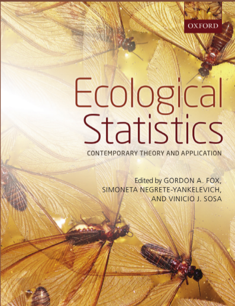

\newcommand{\bm}[1]{#1}

```{r knitr,include=FALSE}
require("knitr")
knit_hooks$set(crop=hook_pdfcrop)
##opts_chunk$set(fig.width=5,fig.height=4,
##               out.width="0.6\\textwidth",
##               fig.align="center",echo=FALSE)
opts_chunk$set(echo=FALSE)
```

```{r pkgs,message=FALSE}
library(lattice)
library(plotrix) ## for axis.break
library(reshape2)
library(ggplot2)
library(RColorBrewer)
library(mvbutils) ## for foodweb()
library(lme4)
library(MASS)
library(nlme)
library(grid)
zmargin <- theme(panel.spacing=unit(0,"lines"))
library(scales) ## for 'scientific', 'trans_format'
theme_set(theme_bw())
```


## (Generalized) linear mixed models

(G)LMMs: a statistical modeling framework incorporating:

-   combinations of categorical and continuous predictors,\
    and interactions
-   (some) non-Normal responses\
    (e.g. binomial, Poisson, and extensions)
-   (some) nonlinearity\
    (e.g. logistic, exponential, hyperbolic)
-   non-independent (grouped) data

{width="\textwidth"}

## Coral protection from seastars (*Culcita*) by symbionts [@mckeon_multiple_2012]

```{r culcita1,cache=TRUE,message=FALSE,warning=FALSE}
## Culcita fits
stierdat <- read.csv("../data/culcitalogreg.csv")
stierdat$ttt <- as.factor(stierdat$ttt) ## treatment should be a factor
## contrast matrix
cmat <- matrix(c(0,1,1,1,0,1,-1,0,0,1,1,-2),ncol=3,
               dimnames=list(NULL,c("symb","crab.vs.shr","addsymb")))
contrasts(stierdat$ttt) <- cmat
stierdat$block <- as.factor(stierdat$block) ## not really necessary but logical
stierdat <- stierdat[,1:4]   ## don't really need the rest
mod0 <- glm(predation~ttt+block,binomial,data=stierdat)
mod1 <- glm(predation~ttt,binomial,data=stierdat)
library(lme4)
mod2 <- glmer(predation~ttt+(1|block),family=binomial,data=stierdat)
## AGQ 
mod2B <- glmer(predation~ttt+(1|block),family=binomial,
               nAGQ=20,data=stierdat)
mod5=glmmPQL(predation~ttt,random=~1|block,family=binomial,data=stierdat)
levels(stierdat$ttt) <- c("none","shrimp","crabs","both")
m <- melt(stierdat[,1:3],id.vars=1:2)
m2 <- dcast(m,ttt~variable,fun.aggregate=mean)
m3 <- dcast(m,ttt+block~variable,fun.aggregate=sum)
p <- with(m3,table(predation,ttt))
``` 


```{r culcita2,warning=FALSE,message=FALSE}
load("../data/culcita.RData")
library(lme4)
cmod1 <- glmer(predation~ttt+(1|block),data=culcita_dat,
               family=binomial,nAGQ=10)
cmod3 <- glm(predation~ttt,data=culcita_dat,family=binomial)
## jump through hoops to get GLM to estimate without complete-separation blocks 7,8,9 messing everything up!
cmod4 <- suppressWarnings(glm(predation~ttt+block,data=transform(culcita_dat,block=relevel(block,2)),
             family=binomial,
             start=c(2,-4,-4,-6,-2,0,0,4,5,30,30,30,5)))
             ## contrasts=list(block=contr.sum),
             ## start=rep(0,)
             ## start=c(10,-4,-5,-6,-20,-8,-8,-8,-5,-3,20,20,20))
r <- ranef(cmod1,condVar=TRUE)
## set up plots
## FIXME:: replace with broom!
library(coefplot2)
f1 <- coeftab(cmod1)
f3 <- coeftab(cmod3)
f4 <- coeftab(cmod4)[1:4,]
r1 <- coeftab(cmod1,ptype="ranef")
r2 <- f3[1,]  ## intercept
r4 <- coeftab(cmod4)[-(1:4),]
v <- data.frame(predict(cmod4,
             newdata=data.frame(block=factor(1:10),ttt="none"),
             se.fit=TRUE))
v$fit <- v$fit-mean(v$fit)
v <- setNames(v[,1:2],c("Estimate","Std..Error"))
w <- data.frame(Estimate=rep(0,10),
                Std..Error=NA,row.names=1:10)
## less clunky way to do this?
dd <- function(X,method,type,
               strip="^ttt") {
  data.frame(method,type,
             p=gsub(strip,"",rownames(X)),X[,1:2],
             stringsAsFactors=FALSE)
}
allEsts <- rbind(dd(f1,"mixed","ttt"),
      dd(f3,"pooled","ttt"),
      dd(f4,"fixed","ttt"),
      dd(r1,"mixed","blocks",
         strip="block\\.\\(Intercept\\)"),
      dd(v,"fixed","blocks"),
      dd(w,"pooled","blocks"))
allEsts <- transform(allEsts,
   p=factor(p,levels=gtools::mixedsort(unique(p))))
```

```{r bplot1,fig.width=8,fig.height=6}
op <- par(las=1,cex=1.5,bty="l")
bb <- barplot(p,ylab="Number of blocks",xlab="Symbionts",
               main="Number of predation events")
bloc <- apply(p,2,cumsum)
midb <- rbind(bloc[1,]/2,
             (bloc[1,]+bloc[2,])/2,
             (bloc[2,]+bloc[3,])/2)
text(bb[col(p)][p>0],midb[p>0],c(0,1,2)[row(p)][p>0])
par(op)
```


## Environmental stress: *Glycera* cell survival (D. Julian unpubl.)

```{r glycera}
x <- read.csv("../data/Live-Dead Tabulated Counts.csv")
## utility function for factoring/renaming variables before
##  lattice plot
rnfac <- function(dat,vars) {
  if (!all(vars %in% names(dat))) stop("unknown variable")
  for (v in vars) {
    dat[[v]] <- factor(dat[[v]])
    levels(dat[[v]]) <- paste(v,"=",round(as.numeric(levels(dat[[v]])),2),sep="")
  }
  dat
}
sc <- function(x) { (x-min(x))/diff(range(x))}
xsc <- x
predvars <- c("Osm","Cu","H2S","Anoxia")
for (i in predvars) {
  xsc[[i]] <- sc(xsc[[i]])
}
xsc$Osm <- xsc$Osm-0.5
## xsc$O2 <- 1-xsc$O2
## names(xsc)[names(xsc)=="O2"] <- "anox"
xr0 <- within(x,FractionAlive <- Alive/(Alive+Dead))
xr <- melt(subset(xr0,select=-c(Alive,Dead)),id.vars=1:5)

x4 <- dcast(xr,H2S+Anoxia+Cu+Osm~.,fun.aggregate=mean)
names(x4)[5] <- "all"
x5 <- rnfac(x4,c("Anoxia","Osm"))

## FIXME: replace with ColorBrewer colours?
cmgen.colors  <- function (n,h1=6/12,h2=10/12,maxs=0.5)  {
    if ((n <- as.integer(n[1])) > 0) {
        even.n <- n%%2 == 0
        k <- n%/%2
        l1 <- k + 1 - even.n
        l2 <- n - k + even.n
        c(if (l1 > 0) hsv(h = h1,
                          s = seq(maxs, ifelse(even.n, 0.5/k, 0), length.out = l1),
                          v = 1),
          if (l2 > 1) hsv(h = h2,
                          s = seq(0, maxs, length.out = l2)[-1],
                          v = 1))
    }
    else character(0)
}
rb.colors <- function(n) {
  cmgen.colors(n,h1=0,h2=0.7,maxs=1)
}
```
 

```{r glycplot1,out.width="\\textwidth",fig.width=8,fig.height=5}
orig <- trellis.par.get()
pad <- 0 ## 15 for regular layout
trellis.par.set(layout.widths=list(right.padding=pad,left.padding=pad),
                regions=list(col=rb.colors(100)),
##                regions=list(col=brewer.pal(11,"RdBu")),
## leave text alone for regular layout
                add.text=list(cex=0.8),axis.text=list(cex=0.5))
levels(x5$Anoxia) <- c("Normoxia","Anoxia")
## print(levelplot(`(all)`~factor(H2S)*factor(Cu)|Anoxia*Osm,
##          col.region=rb.colors(100),
##          data=x5,
##          xlab=expression(H[2]*S),
##          ylab="Copper"))
levelplot(all~factor(H2S)*factor(Cu)|Osm*Anoxia,
                col.region=rb.colors(100), ## brewer.pal(11,"RdBu"), ## rb.colors(100),
                data=x5,
                xlab=expression(H[2]*S),
                ylab="Copper")
trellis.par.set(theme=orig) ## restore settings
## FIXME: redo in ggplot2?  LOW PRIORITY
```

## *Arabidopsis* response to fertilization & herbivory [@banta_comprehensive_2010]

```{r arabplot1,fig.width=7,fig.height=6}
panel.stripplot2 <-
function (x, y, jitter.data = FALSE, factor = 0.5, amount = NULL, 
    horizontal = TRUE, groups = NULL, ...) 
{
    if (!any(is.finite(x) & is.finite(y))) 
        return()
    panel.sizeplot(x = x, y = y, jitter.x = jitter.data && !horizontal, 
        jitter.y = jitter.data && horizontal, factor = factor, 
        amount = amount, groups = groups, horizontal = horizontal, 
        ...)
}
load("../data/Banta.RData")
trellis.par.set(list(fontsize=list(text=20)))
stripplot(jltf ~ amd|nutrient, 
                data=within(dat.tf,jltf <-jitter(log(total.fruits+1),
                  amount=0.05)),
                strip=strip.custom(strip.names=c(TRUE,TRUE)),
                groups=gen, type=c('p','a'),
                ylab="Log(1+fruit set)")
##                main="panel: nutrient, color: genotype")
## trellis.par.set(theme=orig) ## restore settings
```

## Coral demography (J.-S. White unpubl.)

```{r coral_demog,warning=FALSE}
L <- load("../data/m.acr.jagsout.RData")
L2 <- load("../data/m.acr.lme4out.RData")
L3 <- load("../data/demog.mort.18apr.RData")
source("../R/demog_mort_funs.R")
plotfun(j.red2,m.acr.nofr,drop.cols=c(4,8))
```

## Technical definition

\begin{equation*}
\begin{split}
\underbrace{Y_i}_{\text{response}} & \sim \overbrace{\text{Distr}}^{\substack{\text{conditional} \\ \text{distribution}}}(\underbrace{g^{-1}(\eta_i)}_{\substack{\text{inverse} \\ \text{link} \\ \text{function}}},\underbrace{\phi}_{\substack{\text{scale} \\ \text{parameter}}}) \\
\underbrace{\bEta}_{\substack{\text{linear} \\ \text{predictor}}} & 
 = 
\underbrace{\X \bbeta}_{\substack{\text{fixed} \\ \text{effects}}} + 
\underbrace{\Z \bb}_{\substack{\text{random} \\ \text{effects}}}
\\
\underbrace{\bb}_{\substack{\text{conditional} \\ \text{modes}}}  & 
\sim \text{MVN}(\bzero,\underbrace{\Sigma(\btheta)}_{\substack{\text{variance-} \\ \text{covariance} \\ \text{matrix}}})
\end{split}
\end{equation*}

## What are random effects?

A method for …

-   accounting for among-individual, within-block correlation

-   compromising between\
    *complete pooling* (no among-block variance)\
     and *fixed effects* (large among-block variance)

-   handling levels selected at random from a larger population

-   sharing information among levels (`*shrinkage
    estimation*`)

-   estimating variability among levels

-   allowing predictions for unmeasured levels

## Random-effect myths

-   levels of random effects must always be sampled at random
-   a complete sample cannot be treated as a random effect
-   random effects are always a *nuisance variable*
-   nothing can be said about the predictions of a random effect
-   you should always use a random effect no matter how few levels you
have

## Use a random effect if:

(from @bolker_glmm_2014)

- don’t want to test hypotheses about differences between responses at particular levels of
the grouping variable;
- do want to quantify the variability among levels of the grouping variable;
- do want to make predictions about unobserved levels of the grouping variable;
- do want to combine information across levels of the grouping variable;
- have variation in information per level (number of samples or noisiness);
- have levels that are randomly sampled from/representative of a larger population;
- have a categorical predictor that is a nuisance variable (i.e., it is not of direct interest, but should be controlled for).

See also @Crawley2002; @gelman_analysis_2005

If you have sampled fewer than five levels of the grouping variable, you should strongly consider treating it as a fixed effect even if one or more of the criteria above apply.

Estimation
==========

Overview
--------

## Maximum likelihood estimation

-   Best fit is a compromise between two components\
    (consistency of data with fixed effects and conditional modes;
    consistency of random effect with RE distribution)

-   Goodness-of-fit `*integrates*` over conditional modes

```{r plotex,message=FALSE}
set.seed(101)
dd <- data.frame(f=gl(5,5))
dd$y <- simulate(~1+(1|f),newdata=dd,
                 family=gaussian,seed=101,
                 newparams=list(theta=1,beta=0,sigma=1))[[1]]
ggplot(dd,aes(x=f,y=y))+geom_point()+
    stat_summary(fun.y=mean,geom="point",size=3,colour="blue",
                 pch=3)+
     geom_point(data=subset(dd,y<(-2)),colour="red",size=2)+
         theme_update(panel.grid.major=element_blank(),
                      panel.grid.minor=element_blank())
```

## Shrinkage: *Arabidopsis* conditional modes

```{r arabshrink,fig.height=8,fig.width=8}
z<- subset(dat.tf,amd=="clipped" & nutrient=="1")
m1 <- glm(total.fruits~gen-1,data=z,family="poisson")
m2 <- glmer(total.fruits~1+(1|gen),data=z,family="poisson")
tt <- table(z$gen)
rr <- unlist(ranef(m2)$gen)[order(coef(m1))]+fixef(m2)
m1s <- sort(coef(m1))
m1s[1:2] <- rep(-5,2)
gsd <- attr(VarCorr(m2)$gen,"stddev")
gm <- fixef(m2)
nseq <- seq(-3,6,length.out=50)
sizefun <- function(x,smin=0.5,smax=3,pow=2) {
    smin+(smax-smin)*((x-min(x))/diff(range(x)))^pow
}
nv <- dnorm(nseq,mean=gm,sd=gsd)
##
op <- par(las=1,cex=1.5,bty="l")
plot(exp(m1s),xlab="Genotype",ylab="Mean fruit set",
     axes=FALSE,xlim=c(-0.5,25),log="y",yaxs="i",xpd=NA,
     pch=16,cex=0.5)
axis(side=1)
axis(side=2,at=c(exp(-5),0.1,1,10,20),
     labels=c(0,0.1,1,10,20),cex=0.8)
##     ylim=c(-3,5))
polygon(c(rep(0,50),nv*10),exp(c(rev(nseq),nseq)),col="gray",xpd=NA)
n <- tt[order(coef(m1))]
points(exp(rr),pch=16,col=adjustcolor("red",alpha=0.5),
       cex=sizefun(n),xpd=NA)
## text(seq_along(rr),rr,n,pos=3,xpd=NA,cex=0.6)
box()
axis.break(axis=2,breakpos=exp(-4))
legend("bottomright",
       c("group mean","shrinkage est."),
       pch=16,pt.cex=c(1,2),
       col=c("black",adjustcolor("red",alpha=0.5)),
       bty="n")
par(op)
```

Methods
-------

## Estimation methods

- deterministic
    - various approximate integrals [@breslow_whither_2004]
    - penalized quasi-likelihood, Laplace, Gauss-Hermite quadrature, … [@biswas2015];  
best methods needed for large variance, small clusters
    -   flexibility and speed vs. accuracy
- stochastic
- stochastic (Monte Carlo): frequentist and Bayesian
    - [@booth_maximizing_1999; @sung_monte_2007; @ponciano_hierarchical_2009]
    -   usually slower but flexible and accurate

## Laplace-approximation diagnostics

```{r lapl,fig.width=10,fig.height=10}
library(lattice)
aspect <- 0.6
xlab <- "z"; ylab <- "density"; type <- c("g","l"); scaled <- FALSE
mm <- readRDS("../data/toenail_lapldiag.rds")
print(xyplot(y ~ zvals|id, data=mm,
             type=type, aspect=aspect,
             xlab=xlab,ylab=ylab,
             as.table=TRUE,
             panel=function(x,y,...){
    if (!scaled) {
        panel.lines(x, dnorm(x), lty=2)
    } else {
        panel.abline(h=1, lty=2)
    }
    panel.xyplot(x,y,...)
}))
```

## Estimation: *Culcita* [@mckeon_multiple_2012]

````{r stierfig2,warning=FALSE,fig.width=8,fig.height=8}
library(coefplot2)
cvec <- c("purple","magenta","blue","black","darkgreen")
mnames <- c("GLM (fixed)","GLM (pooled)","PQL","Laplace","AGQ")
coefplot2(list(mod2B,mod2,mod5,mod1,
               coeftab(mod0)[1:4,]),
          col.pts=cvec,
          varnames=c("Symbiont",
            "Crab vs. Shrimp",
            "Added symbiont"),xlim=c(-7,3),
          ylim=c(0.9,3.7),
          spacing=0.14,
          main="Log-odds of predation")
par(xpd=NA)
text(rep(1,5),seq(1.6,by=-0.18,length.out=5),
     mnames,col=rev(cvec),cex=0.7,adj=0)
```

# Inference

## Wald tests

-   typical results of `summary`
-   exact for ANOVA, regression:  
approximation for GLM(M)s
-   fast
-   approximation is sometimes awful (Hauck-Donner effect)

## Likelihood ratio tests

-   better than Wald, but still have two problems:
    -   “denominator degrees of freedom” (when estimating scale)
    -   for GLMMs, distributions are approximate anyway (Bartlett corrections)
    -   Kenward-Roger correction? [@stroup_rethinking_2014]
-   Profile confidence intervals: expensive/fragile

## p-values choices?

- guess from classic design ([R code](calcDenDF.R))
- conservative: take minimum number of groups - 1
- Satterthwaite/Kenward-Roger (`lmerTest`, LMMs only)
- parametric bootstrap (`pbkrtest`)

## Parametric bootstrapping

-   fit null model to data
-   simulate “data” from null model
-   fit null and working model, compute likelihood difference
-   repeat to estimate null distribution
-   should be OK but ??? not well tested  
(assumes estimated parameters are "sufficiently" good)

## Bayesian inference

-   If we have a good sample from the posterior distribution (Markov chains have converged etc. etc.) we get most of the inferences we want for free by summarizing the marginal posteriors
-   `*post hoc*` Bayesian methods: use deterministic/frequentist methods to find the maximum, then sample around it

## *Culcita* confidence intervals

## formula formats

-   `fixed`: fixed-effect formula
-   `random`: random-effect formula (in `lme4`, combined with fixed)
    -   generally `x|g` (term|grouping variable)
    -   simplest: `1|g`, single intercept term
    -   nested: `1|g1/g2`
    -   random-slopes: `r|g`
    -   independent terms: `(1|g)+(x+0|g)` or `(x||g)`
-   `lme`: `weights`, `correlation` for heteroscedasticity and residual correlation
-   `MCMCglmm`: options for variance structure

# Challenges & open questions

## On beyond `lme4`

-  `glmmTMB`: zero-inflated and other distributions
-  `brms`,`rstanarm`: interfaces to Stan
-  `INLA`: spatial and temporal correlations

## On beyond R

-   Julia: MixedModels package
-   SAS: PROC MIXED, NLMIXED
-   AS-REML
-   Stata (GLLAMM, xtmelogit)
-   AD Model Builder; Template Model Builder
-   HLM, MLWiN
-   JAGS, Stan, [rethinking package](https://github.com/rmcelreath/rethinking)

{width="4cm"}

## Challenges

-   Small clusters: need AGQ/MCMC
-   Small numbers of clusters: need finite-size corrections (KR/PB/MCMC)
-   Small data sets: issues with *singular* fits  
[@barr_random_2013] vs. [@bates_parsimonious_2015]
-   Big data: speed!
-   Model diagnosis
-   Confidence intervals accounting for uncertainty in variances

See also:
<https://rawgit.com/bbolker/mixedmodels-misc/master/ecostats_chap.html>
<https://groups.nceas.ucsb.edu/non-linear-modeling/projects>

## Spatial and temporal correlations

-   Sometimes blocking takes care of non-independence ...
-   but sometimes there is temporal or spatial correlation *within* blocks
-    ... also phylogenetic ... [@ives_statistics_2006]
-   "G-side" vs. "R-side" effects
-   tricky to implement for GLMMs, but new possibilities on the horizon
[@Rue+2009; @rousset_testing_2014];
[https://github.com/stevencarlislewalker/lme4ord](lme4ord package)

## Next steps

-   Complex random effects:   
    regularization, model selection, penalized methods (lasso/fence)
-   Flexible correlation and variance structures
-   Flexible/nonparametric random effects distributions
-   hybrid & improved MCMC methods
-   *Reliable* assessment of out-of-sample performance

## 

-   <http://ms.mcmaster.ca/~bolker/misc/private/14-Fox-Chap13.pdf>

-   <https://rawgit.com/bbolker/mixedmodels-misc/master/ecostats_chap.html>

-   [@bolker_glmm_2014]



(code ASPROMP8)
