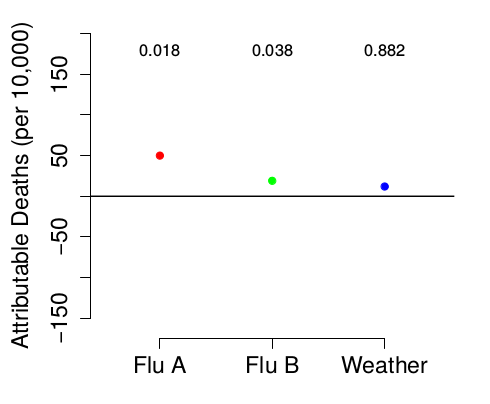
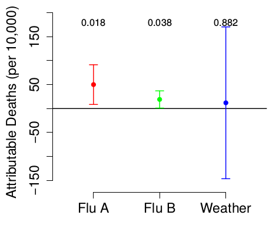

# Philosophy

## What do we mean by statistical inference?

answering **scientific questions**

- clear, well-posed questions (theory) >
     - good experimental design >
          - statistical practice
	 
... all are necessary, all connected!

- statistics is for:
    - quantifying best guesses (point estimates)
	- quantifying uncertainty (confidence intervals)
	- statements about *clarity* (statistical significance testing)

## reproducibility crisis

many scientific results are unreproducible

- lack of openness (data/methods)
- questionable research practices (QRPs)
- p-hacking; snooping [@simmons_false-positive_2011]; "Texas sharpshooter fallacy"
- "garden of forking paths" (Gelman)


**analytic decisions must be made independently of the data**

pre-registration (formal or informal);  
at least recognize the line between confirmatory and exploratory analyses

## scientific hell


## power analysis

- experimental design: **before** you observe/experiment
- think about *biological* effect sizes: what is the *smallest* effect that would be biologically interesting?
- need to specify effects and variances (standard deviations)
- simple designs (t-test, ANOVA, etc.)
     - base R: `apropos("power")`
     - [Russ Lenth home page](http://homepage.stat.uiowa.edu/~rlenth/Power/oldversion.html)
- most power analyses are crude/order-of-magnitude
- simulation-based power analysis (@Bolker2008 ch. 5)

## goals of analysis [@harrell_regression_2001]

- exploration
- prediction
- inference

## exploration

- looking for patterns *only*
- no p-values at all
- confidence intervals (perhaps),  
but taken with an inferential grain of salt

## prediction

- want quantitative answers about specific cases
- consider algorithmic approaches (esp. for big data)
- penalized approaches:  
automatically reduce model complexity
- confidence intervals are hard

## inference

most typical scientific goal

*qualitative* statements about clarity and importance of effects:

- effects that are distinguishable from null hypothesis of noise
- test among discrete hypotheses 

*quantitative* statements:

- relative strength/magnitude of effects
- importance (e.g. fraction variance explained)

## what do p-values really mean?

- something about "strength of evidence"
- **not** "evidence for no effect" or "no difference"
- null hypotheses in ecology are never (?) true
- "the difference between significant and non-significant is not significant" [@gelman_difference_2006]
- try talking about statistical **clarity** instead

## p-value example

```{r pvals,echo=FALSE}
dd <- data.frame(ttt=LETTERS[1:4],y=c(1,1,5,5),bar=c(0.6,1.5,0.6*5,1.5*5))
dd <- transform(dd,pvalue=2*pnorm(y,sd=bar/1.96,lower.tail=FALSE))
cc <- as.matrix(dd[,"pvalue"])
dimnames(cc) <- list(dd$ttt,"p value")
printCoefmat(cc,P.values=TRUE,has.Pvalue=TRUE,cs.ind=numeric(0),
             tst.ind=numeric(0),digits=3)

```{r pvalplot,echo=FALSE}
library(ggplot2); theme_set(theme_bw())
ggplot(dd,aes(ttt,y))+
    geom_pointrange(aes(ymin=y-bar,ymax=y+bar))+
    geom_hline(yintercept=0,lty=2)+
    scale_y_continuous(breaks=numeric(0))+
    labs(x="condition",y="estimate")+
    theme_classic()
```

## Real example [@dushoff_mortality_2006]

From a study of influenza mortality, estimating fraction of
mortality attributable to influenza A, influenza B, or
weather alone ...



Why does weather not seem to have an effect???

## The explanation



# realism in data analysis

## how much data do you need for a given model?

- link to video
- rule of thumb: 10-20 per data point
- rules for continuous, count, binomial data
- counting data points/"degrees of freedom" for clustered data?

## dimension reduction

- must be *a priori*
- discard interactions
- simplify questions
- collapse variables, e.g. by PCA

# overview of inference

## modes of inference (@Bolker2008 chapter 6)

- Wald vs. likelihood ratio vs. Bayesian
- information-theoretic (AIC etc.) methods
- single vs. multiple parameters:  
e.g. $Z$ vs $\chi^2$
- finite-size vs asymptotic:  
e.g. $Z$ vs. $t$

```{r profile_vs_wald,echo=FALSE,message=FALSE,fig.width=8,fig.height=8}
par(las=1,bty="l")
library(ellipse)
library(bbmle)
data(ReedfrogFuncresp,package="emdbook")
m2 = mle2(Killed~dbinom(prob=a/(1+a*h*Initial),size=Initial),
          start=list(a=0.5,h=0.0125),
          data=ReedfrogFuncresp)
binomNLL2 = function(p,N,k) {
  a = p[1]
  h = p[2]
  predprob = a/(1+a*h*N)
  with(ReedfrogFuncresp,-sum(dbinom(k,prob=predprob,size=N,log=TRUE)))
}
op <- par(lwd=2,bty="l",las=1,cex=1.5)
bsurf3 <-  emdbook::curve3d(binomNLL2(c(x,y),N=ReedfrogFuncresp$Initial,k=ReedfrogFuncresp$Killed),
  sys="contour",from=c(0.3,0.001),to=c(0.82,0.04),n=c(51,51),
  levels=-logLik(m2)+qchisq(c(0.8,0.995),2)/2,
  drawlabels=FALSE,
  xlab="Attack rate (a)",ylab="Handling time (h)")
lines(ellipse(vcov(m2),centre=coef(m2),level=0.8),col="gray")
lines(ellipse(vcov(m2),centre=coef(m2),level=0.995),col="gray")
legend("topleft",c("profile","information"),lty=1,col=c("black","gray"),
       bty="n")
text(c(0.65,0.72),c(0.027,0.036),c("80%","99.5%"))
par(op)
```

## Bayesian stats 101

- frequentist inference: based on likelihood function + sampling properties
- ${\cal L} = \textrm{Prob}(\theta|x)$
- Bayesian inference: based on likelihood + prior
    - $\textrm{Posterior}(\theta) \propto {\cal L}(\theta|x) \textrm{Prior}(\theta)$
- priors are important
- Bayesian *credible intervals* based on highest posterior density or quantiles

results **more explicitly** based on model + prior choices

## Bayesian stats 102

- *Markov chain Monte Carlo*: computational methods for sampling from the posterior
- once we have a a sample we can compute mean, confidence intervals ...
- e.g. `MCMCglmm`, `brms`, `rethinking`


## References
